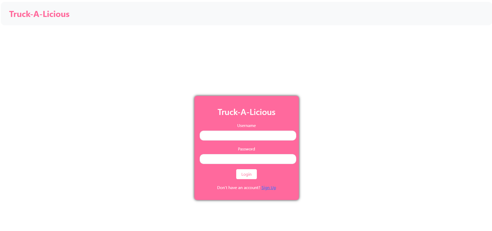
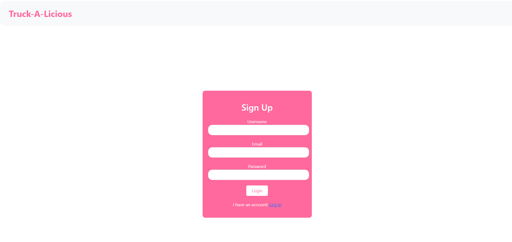

# Project2-Group3

## Description

We created an application that will assist food truck owners in connecting to their customers.  Our application allows a food truck owner to create an account associated with their business.  Then, they will be able to display the location and times of business to a public database available to all users.  Both regular users and business owners will be able to view an upcoming forecast of weather in order to optimally plan locations and times.

## Table of Contents

- [Technologies](#technologies)
- [Usage](#usage)
- [Credits](#credits)
- [License](#license)

## Technologies

This application uses React to create its user interface.  It uses JWT to authenticate business owners as power users.  Using Node.js and Express.js, we created a RESTful API to facilitate interaction between client and server components.  we also used weather and geolocation server-side APIs to access external databases.  For our own database, we used PostgreSQL and Sequelize ORM.

## Usage

From the home page, users can access a public database of food trucks including their schedules and location.  To view additional detail about each food truck, click on the name of the food truck you would like to view.

As a food truck owner, users can sign into a profile by clicking the 'log in' option on the top right corner.  New users without an account will be prompted to create a new account, or can directly access the 'sign up' form from the home page.

Once in the 'sign up' form, a food truck owner can enter the name, location, and open times of their business.  Once completed, they can then submit their information, which will be logged in the public database for other users to access.

## Credits

Webert, Lauren      https://github.com/lwebert

Lesner, Thomas      https://github.com/tlesner

Franco, Brandon     https://github.com/BFrausb

Chi, Julius         https://github.com/JuliusC72

## License

MIT License

Copyright (c) 2025 lwebert, tlesner, Bfrausb, JuliusC72

Permission is hereby granted, free of charge, to any person obtaining a copy
of this software and associated documentation files (the "Software"), to deal
in the Software without restriction, including without limitation the rights
to use, copy, modify, merge, publish, distribute, sublicense, and/or sell
copies of the Software, and to permit persons to whom the Software is
furnished to do so, subject to the following conditions:

The above copyright notice and this permission notice shall be included in all
copies or substantial portions of the Software.

THE SOFTWARE IS PROVIDED "AS IS", WITHOUT WARRANTY OF ANY KIND, EXPRESS OR
IMPLIED, INCLUDING BUT NOT LIMITED TO THE WARRANTIES OF MERCHANTABILITY,
FITNESS FOR A PARTICULAR PURPOSE AND NONINFRINGEMENT. IN NO EVENT SHALL THE
AUTHORS OR COPYRIGHT HOLDERS BE LIABLE FOR ANY CLAIM, DAMAGES OR OTHER
LIABILITY, WHETHER IN AN ACTION OF CONTRACT, TORT OR OTHERWISE, ARISING FROM,
OUT OF OR IN CONNECTION WITH THE SOFTWARE OR THE USE OR OTHER DEALINGS IN THE
SOFTWARE.